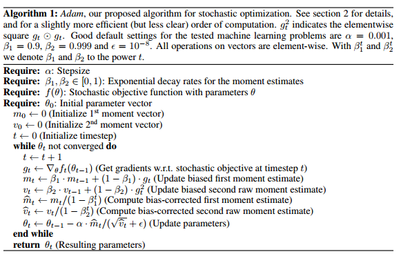

# Adam Optimization Algorithm

> adaptive moment estimation

> Adam 优化算法是随机梯度下降算法的扩展式

## 什么是Adam

Adam 是一种可以替代传统随机梯度下降过程的一阶优化算法，它能基于训练数据迭代地更新神经网络权重。

Adam 优化算法应用在非凸优化问题中所获得的优势：

* 直截了当地实现

* 高效的计算

* 所需内存少

* 梯度对角缩放的不变性（第二部分将给予证明）

* 适合解决含大规模数据和参数的优化问题

* 适用于非稳态（non-stationary）目标

* 适用于解决包含很高噪声或稀疏梯度的问题

* 超参数可以很直观地解释，并且基本上只需极少量的调参

## Adam 优化算法的基本机制

Adam 算法和传统的随机梯度下降不同。随机梯度下降保持单一的学习率（即 alpha）更新所有的权重，学习率在训练过程中并不会改变。而 Adam 通过计算梯度的一阶矩估计和二阶矩估计而为不同的参数设计独立的自适应性学习率。

Adam 算法的提出者描述其为两种随机梯度下降扩展式的优点集合，即：

适应性梯度算法（AdaGrad）为每一个参数保留一个学习率以提升在稀疏梯度（即自然语言和计算机视觉问题）上的性能。

均方根传播（RMSProp）基于权重梯度最近量级的均值为每一个参数适应性地保留学习率。这意味着算法在非稳态和在线问题上有很有优秀的性能。

Adam 算法同时获得了 AdaGrad 和 RMSProp 算法的优点。Adam 不仅如 RMSProp 算法那样基于一阶矩均值计算适应性参数学习率，它同时还充分利用了梯度的二阶矩均值（即有偏方差/uncentered variance）。具体来说，算法计算了梯度的指数移动均值（exponential moving average），超参数 beta1 和 beta2 控制了这些移动均值的衰减率。

移动均值的初始值和 beta1、beta2 值接近于 1（推荐值），因此矩估计的偏差接近于 0。该偏差通过首先计算带偏差的估计而后计算偏差修正后的估计而得到提升。

## 算法

