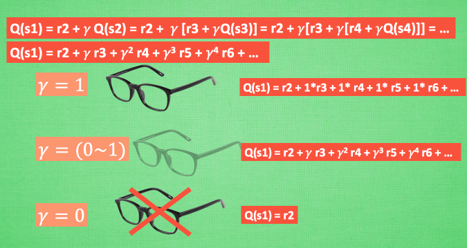
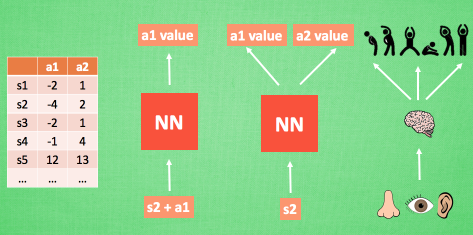
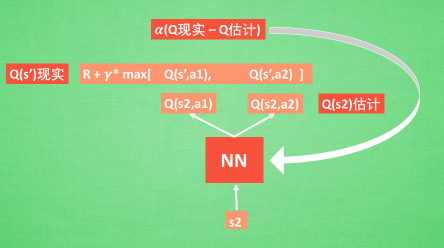

# Deep Q Network

## 什么是 Deep Q Network

2015年Deepmind（AlphaGO的开发团队）在Nature发表了[Human-level Control Through Deep Reinforcement learning](https://github.com/Xib1uvXi/ai/blob/master/python/open-day/DQN.pdf)论文，
内容是使用强化学习和深度学习来训练AI玩Atari.Deepmind开启了所谓的“深度强化学习”的时代.

### Q learning（Reinforcement learning）

在介绍DQN之前，先简单介绍下Q learning

> 图片来源： https://simple.wikipedia.org/wiki/Reinforcement_learning

#### 行为准则

我们做事情都会有一个自己的行为准则, 比如小时候爸妈常说”不写完作业就不准看电视”. 所以我们在 写作业的这种状态下, 好的行为就是继续写作业, 直到写完它, 我们还可以得到奖励, 不好的行为 就是没写完就跑去看电视了, 被爸妈发现, 后果很严重. 小时候这种事情做多了, 也就变成我们不可磨灭的记忆. 这和我们要提到的 Q learning 有什么关系呢? 原来 Q learning 也是一个决策过程, 和小时候的这种情况差不多. 我们举例说明.

假设现在我们处于写作业的状态而且我们以前并没有尝试过写作业时看电视, 所以现在我们有两种选择 , 1, 继续写作业, 2, 跑去看电视. 因为以前没有被罚过, 所以我选看电视, 然后现在的状态变成了看电视, 我又选了 继续看电视, 接着我还是看电视, 最后爸妈回家, 发现我没写完作业就去看电视了, 狠狠地惩罚了我一次, 我也深刻地记下了这一次经历, 并在我的脑海中将 “没写完作业就看电视” 这种行为更改为负面行为.

#### Q-Learning

假设我们的行为准则已经学习好了, 现在我们处于状态s1, 我在写作业, 我有两个行为 a1, a2, 分别是看电视和写作业, 根据我的经验, 在这种 s1 状态下, a2 写作业 带来的潜在奖励要比 a1 看电视高, 这里的潜在奖励我们可以用一个有关于 s 和 a 的 Q 表格代替, 在我的记忆Q表格中, Q(s1, a1)=-2 要小于 Q(s1, a2)=1, 所以我们判断要选择 a2 作为下一个行为. 现在我们的状态更新成 s2 , 我们还是有两个同样的选择, 重复上面的过程, 在行为准则Q 表中寻找 Q(s2, a1) Q(s2, a2) 的值, 并比较他们的大小, 选取较大的一个. 接着根据 a2 我们到达 s3 并在此重复上面的决策过程. Q learning 的方法也就是这样决策的

所以我们回到之前的流程, 根据 Q 表的估计, 因为在 s1 中, a2 的值比较大, 通过之前的决策方法, 我们在 s1 采取了 a2, 并到达 s2, 这时我们开始更新用于决策的 Q 表, 接着我们并没有在实际中采取任何行为, 而是再想象自己在 s2 上采取了每种行为, 分别看看两种行为哪一个的 Q 值大, 比如说 Q(s2, a2) 的值比 Q(s2, a1) 的大, 所以我们把大的 Q(s2, a2) 乘上一个衰减值 gamma (比如是0.9) 并加上到达s2时所获取的奖励 R (这里还没有获取到我们的棒棒糖, 所以奖励为 0), 因为会获取实实在在的奖励 R , 我们将这个作为我现实中 Q(s1, a2) 的值, 但是我们之前是根据 Q 表估计 Q(s1, a2) 的值. 所以有了现实和估计值, 我们就能更新Q(s1, a2) , 根据 估计与现实的差距, 将这个差距乘以一个学习效率 alpha 累加上老的 Q(s1, a2) 的值 变成新的值. 但时刻记住, 我们虽然用 maxQ(s2) 估算了一下 s2 状态, 但还没有在 s2 做出任何的行为, s2 的行为决策要等到更新完了以后再重新另外做. 这就是 off-policy 的 Q learning 是如何决策和学习优化决策的过程.

这一张图概括了我们之前所有的内容. 这也是 Q learning 的算法, 每次更新我们都用到了 Q 现实和 Q 估计, 而且 Q learning 的迷人之处就是 在 Q(s1, a2) 现实 中, 也包含了一个 Q(s2) 的最大估计值, 将对下一步的衰减的最大估计和当前所得到的奖励当成这一步的现实, 很奇妙吧. 最后我们来说说这套算法中一些参数的意义. Epsilon greedy 是用在决策上的一种策略, 比如 epsilon = 0.9 时, 就说明有90% 的情况我会按照 Q 表的最优值选择行为, 10% 的时间使用随机选行为. alpha是学习率, 来决定这次的误差有多少是要被学习的, alpha是一个小于1 的数. gamma 是对未来 reward 的衰减值. 我们可以这样想象.

Q-Learning 中的 Gamma

我们重写一下 Q(s1) 的公式, 将 Q(s2) 拆开, 因为Q(s2)可以像 Q(s1)一样,是关于Q(s3) 的, 所以可以写成这样, 然后以此类推, 不停地这样写下去, 最后就能写成这样, 可以看出Q(s1) 是有关于之后所有的奖励, 但这些奖励正在衰减, 离 s1 越远的状态衰减越严重. 不好理解? 行, 我们想象 Q-learning 的机器人天生近视眼, gamma = 1 时, 机器人有了一副合适的眼镜, 在 s1 看到的 Q 是未来没有任何衰变的奖励, 也就是机器人能清清楚楚地看到之后所有步的全部价值, 但是当 gamma =0, 近视机器人没了眼镜, 只能摸到眼前的 reward, 同样也就只在乎最近的大奖励, 如果 gamma 从 0 变到 1, 眼镜的度数由浅变深, 对远处的价值看得越清楚, 所以机器人渐渐变得有远见, 不仅仅只看眼前的利益, 也为自己的未来着想.

### DNQ

我们使用表格来存储每一个状态 state, 和在这个 state 每个行为 action 所拥有的 Q 值. 而当今问题是在太复杂, 状态可以多到比天上的星星还多(比如下围棋). 如果全用表格来存储它们, 恐怕我们的计算机有再大的内存都不够, 而且每次在这么大的表格中搜索对应的状态也是一件很耗时的事. 不过, 在机器学习中, 有一种方法对这种事情很在行, 那就是神经网络. 我们可以将状态和动作当成神经网络的输入, 然后经过神经网络分析后得到动作的 Q 值, 这样我们就没必要在表格中记录 Q 值, 而是直接使用神经网络生成 Q 值. 还有一种形式的是这样, 我们也能只输入状态值, 输出所有的动作值, 然后按照 Q learning 的原则, 直接选择拥有最大值的动作当做下一步要做的动作. 我们可以想象, 神经网络接受外部的信息, 相当于眼睛鼻子耳朵收集信息, 然后通过大脑加工输出每种动作的值, 最后通过强化学习的方式选择动作.

接下来我们基于第二种神经网络来分析, 我们知道, 神经网络是要被训练才能预测出准确的值. 那在强化学习中, 神经网络是如何被训练的呢? 首先, 我们需要 a1, a2 正确的Q值, 这个 Q 值我们就用之前在 Q learning 中的 Q 现实来代替. 同样我们还需要一个 Q 估计 来实现神经网络的更新. 所以神经网络的的参数就是老的 NN 参数 加学习率 alpha 乘以 Q 现实 和 Q 估计 的差距. 我们整理一下.

我们通过 NN 预测出Q(s2, a1) 和 Q(s2,a2) 的值, 这就是 Q 估计. 然后我们选取 Q 估计中最大值的动作来换取环境中的奖励 reward. 而 Q 现实中也包含从神经网络分析出来的两个 Q 估计值, 不过这个 Q 估计是针对于下一步在 s’ 的估计. 最后再通过刚刚所说的算法更新神经网络中的参数. 但是这并不是 DQN 会玩游戏的根本原因. 还有两大因素支撑着 DQN 使得它变得无比强大. 这两大因素就是 Experience replay 和 Fixed Q-targets.

简单来说, DQN 有一个记忆库用于学习之前的经历. 在上面提到过, Q learning 是一种 off-policy 离线学习法, 它能学习当前经历着的, 也能学习过去经历过的, 甚至是学习别人的经历. 所以每次 DQN 更新的时候, 我们都可以随机抽取一些之前的经历进行学习. 随机抽取这种做法打乱了经历之间的相关性, 也使得神经网络更新更有效率. Fixed Q-targets 也是一种打乱相关性的机理, 如果使用 fixed Q-targets, 我们就会在 DQN 中使用到两个结构相同但参数不同的神经网络, 预测 Q 估计 的神经网络具备最新的参数, 而预测 Q 现实 的神经网络使用的参数则是很久以前的. 有了这两种提升手段, DQN 才能在一些游戏中超越人类.